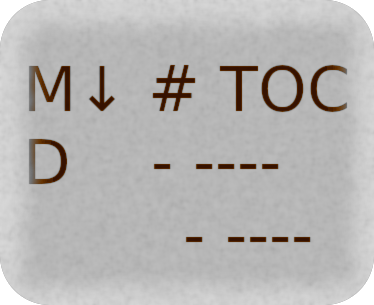
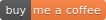

# Markdown Table Of Contents



[](https://pypi.org/project/md-toc/)
[](https://repology.org/project/md-toc/versions)
[](https://repology.org/project/python:md-toc/versions)
[](https://pepy.tech/project/md-toc)
[](https://libraries.io/pypi/md-toc/dependents)
[](https://github.com/pre-commit/pre-commit)
[](https://buymeacoff.ee/frnmst)

Automatically generate a compliant table of contents for a markdown file
to improve document readability.

<!--TOC-->

- [Markdown Table Of Contents](#markdown-table-of-contents)
  - [Video](#video)
  - [Description](#description)
  - [Features](#features)
  - [Examples](#examples)
  - [API examples](#api-examples)
  - [Documentation](#documentation)
  - [CLI Helps](#cli-helps)
  - [License](#license)
  - [Changelog and trusted source](#changelog-and-trusted-source)
  - [Crypto donations](#crypto-donations)

<!--TOC-->

## Video

[](https://asciinema.org/a/452384)

## Description

The table of contents (a.k.a: TOC) generated by this program is designed
to work with several markdown parsers such as the ones used by GitHub
and GitLab.

Rules for generating the TOC are determined by the selected markdown
parser. md-toc aimes infact to be as conformant as possible in respect
to each one of them. This was possible by studying the available
documentations and by reverse engineering the source codes.

GitHub and GitLab have introduced their version of the markdown TOC
after md-toc and similar tools were created:

- in March 2021 GitHub added an
  [interactive TOC button](https://github.blog/changelog/2021-04-13-table-of-contents-support-in-markdown-files/)
  at the top-left of readme files. This system works for markdown and others
- GitLab added an [extension](https://docs.gitlab.com/ee/user/markdown.html#table-of-contents)
  called `Table of contents` to its Gitlab Flavored Mardown

## Features

- works offline
- edits file in place using a TOC marker (default `<!--TOC-->`) or
  output to standard output
- selection of indentation level
- list indentation based on heading, which can optionally be disabled
- outputs an ordered or unordered TOC list
- creates anchor links to markdown headings by default or a plain list
  as alternative
- checks if heading level is coherent: this avoid creating an
  erroneous TOC. This feature can be disabled if needed
- skip any number lines before generating the TOC
- can read content from standard input
- handles multiple files at once
- selection of newline string
- selection of list marker
- supports GitHub, GitLab, Commonmark, Redcarpet and others
- [pre-commit](https://pre-commit.com/)
  [hook](https://docs.franco.net.eu.org/md-toc/pre_commit_hook.html)

And more! See the
[feature comparison table](https://docs.franco.net.eu.org/md-toc/features.html)

## Examples

You can use md-toc in your blog, documentation based on markdown,
etc...

I use it in [my Jekyll-based blog](https://blog.franco.net.eu.org/)
along with its
[pre-commit hook](https://software.franco.net.eu.org/frnmst/blog/src/branch/master/.pre-commit-config.yaml).
I also use it in most repositories where markdown README files are
present.

Most markdown renderers do not provide a way to automatically generate a
TOC so md-toc is useful for this purpose.

A very common use case is this:

```shell
$ cat foo.md

# Table of contents

<!--TOC-->

# this
## is
## a
### foo
#### booo
### foo
## file

## bye

# bye

$ md_toc --in-place github --header-levels 6 foo.md        # or: md_toc -p github -l6 foo.md
$ cat foo.md

# Table of contents

<!--TOC-->

- [Table of contents](#table-of-contents)
- [this](#this)
  - [is](#is)
  - [a](#a)
    - [foo](#foo)
      - [booo](#booo)
    - [foo](#foo-1)
  - [file](#file)
  - [bye](#bye)
- [bye](#bye-1)

<!--TOC-->

# this
## is
## a
### foo
#### booo
### foo
## file

## bye

# bye
```

## API examples

md-toc has a
[public API](https://docs.franco.net.eu.org/md-toc/api.html).
This means for example that you can you easily build a TOC within another Python
program. The easiest way to build one for a markdown file is:

```python
>>> import md_toc
>>> f = open('foo.md')
>>> print(f.read(), end='')
# this
## is
## a
### foo
#### booo
### foo
## file

## bye

# bye
>>> print(md_toc.build_toc('foo.md'), end='')
- [this](#this)
  - [is](#is)
  - [a](#a)
    - [foo](#foo)
    - [foo](#foo-1)
  - [file](#file)
  - [bye](#bye)
- [bye](#bye-1)
```

## Documentation

<https://docs.franco.net.eu.org/md-toc/>

Please read carefully the
[Markdown specification](https://docs.franco.net.eu.org/md-toc/markdown_specification.html)
section of the documentation to learn how this program parsers markdown
files and builds a correct output.

## CLI Helps

```shell
$ md_toc --help
$ md_toc cmark --help
$ md_toc commonmarker --help
$ md_toc github --help
$ md_toc gitlab --help
$ md_toc goldmark --help
$ md_toc redcarpet --help
```

## License

Copyright (C) 2017-2022 Franco Masotti (franco \D\o\T masotti {-A-T-} tutanota \D\o\T com)

md-toc is free software: you can redistribute it and/or modify it under
the terms of the GNU General Public License as published by the Free
Software Foundation, either version 3 of the License, or (at your
option) any later version.

md-toc is distributed in the hope that it will be useful, but WITHOUT
ANY WARRANTY; without even the implied warranty of MERCHANTABILITY or
FITNESS FOR A PARTICULAR PURPOSE. See the GNU General Public License for
more details.

You should have received a copy of the GNU General Public License along
with md-toc. If not, see <http://www.gnu.org/licenses/>.

## Changelog and trusted source

You can check the authenticity of new releases using my public key.

Changelogs, instructions, sources and keys can be found at
[blog.franco.net.eu.org/software/#md-toc](https://blog.franco.net.eu.org/software/#md-toc).

## Crypto donations

- Bitcoin: bc1qnkflazapw3hjupawj0lm39dh9xt88s7zal5mwu
- Monero: 84KHWDTd9hbPyGwikk33Qp5GW7o7zRwPb8kJ6u93zs4sNMpDSnM5ZTWVnUp2cudRYNT6rNqctnMQ9NbUewbj7MzCBUcrQEY
- Dogecoin: DMB5h2GhHiTNW7EcmDnqkYpKs6Da2wK3zP
- Vertcoin: vtc1qd8n3jvkd2vwrr6cpejkd9wavp4ld6xfu9hkhh0
