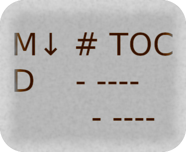
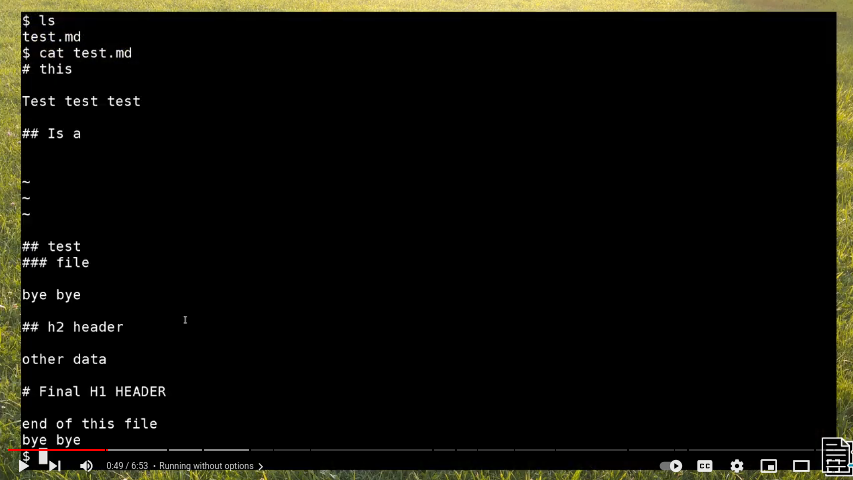

<!--
SPDX-FileCopyrightText: 2017-2026 Franco Masotti (See /README.md)

SPDX-License-Identifier: GPL-3.0-or-later
-->

# Markdown Table Of Contents



[](https://pypi.org/project/md-toc/)
[](https://repology.org/project/md-toc/versions)
[](https://repology.org/project/python:md-toc/versions)
[](https://anaconda.org/conda-forge/md-toc)
[](https://pepy.tech/project/md-toc)
[](https://libraries.io/pypi/md-toc/dependents)
[](https://github.com/pre-commit/pre-commit)
[](https://buymeacoff.ee/frnmst)

Automatically generate and add an accurate table of contents to markdown files.

<!--TOC-->

- [Markdown Table Of Contents](#markdown-table-of-contents)
  - [Video](#video)
  - [Description](#description)
  - [Features](#features)
  - [Examples](#examples)
  - [API examples](#api-examples)
  - [Quickstart](#quickstart)
    - [Distribution packages](#distribution-packages)
    - [One minute setup](#one-minute-setup)
    - [Safe install](#safe-install)
  - [Documentation](#documentation)
  - [CLI Helps](#cli-helps)
  - [Extras](#extras)
    - [HTML output](#html-output)
  - [Contributing](#contributing)
  - [Consulting and custom integrations](#consulting-and-custom-integrations)
  - [License](#license)
  - [Git forge mirrors](#git-forge-mirrors)
  - [Support this project](#support-this-project)

<!--TOC-->

## Video

[](https://www.youtube.com/watch?v=guyVdPNmC0A&t=49s)

## Description

The table of contents (a.k.a: TOC) generated by this program is designed
to work with several markdown parsers such as the ones used by GitHub
and GitLab.

Rules for generating the TOC are determined by the selected markdown
parser. md-toc aimes infact to be as conformant as possible in respect
to each one of them. This was possible by studying the available
documentations and by reverse engineering the source codes.

GitHub and GitLab have introduced their version of the markdown TOC
after md-toc and similar tools were created:

- in March 2021 GitHub added an
  [interactive TOC button](https://github.blog/changelog/2021-04-13-table-of-contents-support-in-markdown-files/)
  at the top-left of readme files. This system works for markdown and others
- GitLab added an [extension](https://docs.gitlab.com/ee/user/markdown.html#table-of-contents)
  called `Table of contents` to its Gitlab Flavored Mardown

However, md-toc has unique features and is used in systems without automatic
TOCs.

## Features

- works offline
- edits file in place using a TOC marker (default `<!--TOC-->`) or
  output to standard output
- maximum heading level selection (1 to 6)
- list indentation based on heading, which can optionally be disabled
- outputs an ordered or unordered TOC list with list marker selection
- creates anchor links to markdown headings by default or a plain list
  as alternative
- checks if heading level is coherent: this avoid creating an
  erroneous TOC. This feature can be disabled if needed
- skip any number lines before generating the TOC
- can read content from standard input
- handles multiple files at once
- selection of newline string
- check if there is difference between existing TOC in file and newly generated
  one
- supports GitHub, GitLab, Commonmark, Redcarpet and others
- [pre-commit](https://pre-commit.com/) md-toc
  [hook](https://docs.franco.net.eu.org/md-toc/pre_commit_hook.html)
- deterministic output: no AI features, no hallucinations, no tokens, no costs

And more! See the
[feature comparison table](https://docs.franco.net.eu.org/md-toc/features.html)

## Examples

You can use md-toc in your blog, documentation based on markdown, GitHub pages,
markdown files in Nextcloud, etc...

I use it in [my Jekyll-based blog](https://blog.franco.net.eu.org/)
along with its
[pre-commit hook](https://codeberg.org/frnmst/blog/src/branch/master/.pre-commit-config.yaml).
I also use it in most repositories where `README.md` files are present.

Most markdown renderers do not provide a way to automatically generate a
TOC so md-toc is useful for this purpose.

A very common use case is this:

```shell
$ cat foo.md

# Table of contents

<!--TOC-->

# this
## is
## a
### foo
#### booo
### foo
## file

## bye

# bye

$ md_toc --in-place github --header-levels 6 foo.md        # or: md_toc -p github foo.md
$ cat foo.md

# Table of contents

<!--TOC-->

- [Table of contents](#table-of-contents)
- [this](#this)
  - [is](#is)
  - [a](#a)
    - [foo](#foo)
      - [booo](#booo)
    - [foo](#foo-1)
  - [file](#file)
  - [bye](#bye)
- [bye](#bye-1)

<!--TOC-->

# this
## is
## a
### foo
#### booo
### foo
## file

## bye

# bye
```

## API examples

md-toc has a
[public API](https://docs.franco.net.eu.org/md-toc/api.html).
This means for example that you can you easily build a TOC within another Python
program. The easiest way to build one for a markdown file is:

```python
>>> import md_toc
>>> f = open('foo.md')
>>> print(f.read(), end='')
# this
## is
## a
### foo
#### booo
### foo
## file

## bye

# bye
>>> print(md_toc.api.build_toc('foo.md'), end='')
- [this](#this)
  - [is](#is)
  - [a](#a)
    - [foo](#foo)
      - [boo](#boo)
    - [foo](#foo-1)
  - [file](#file)
  - [bye](#bye)
- [bye](#bye-1)
```

You can also write the TOC in place:

```python
>>> import md_toc
>>> f = open('foo.md')
>>> print(f.read(), end='')
# Table of contents

<!--TOC-->

# this
## is
## a
### foo
#### booo
### foo
## file

Test

## bye

# bye
>>> toc = md_toc.api.build_toc('foo.md')
>>> md_toc.write_string_on_file_between_markers('foo.md', toc, '<!--TOC-->')
>>> f = open('foo.md')
>>> print(f.read(), end='')
# Table of contents

<!--TOC-->

- [Table of contents](#table-of-contents)
- [this](#this)
  - [is](#is)
  - [a](#a)
    - [foo](#foo)
      - [boo](#boo)
    - [foo](#foo-1)
  - [file](#file)
  - [bye](#bye)
- [bye](#bye-1)

<!--TOC-->

# this
## is
## a
### foo
#### booo
### foo
## file

Test

## bye

# bye
```

## Quickstart

### Distribution packages

Packages exist for Arch Linux, Debian, Ubuntu and Nix. See

- https://tracker.debian.org/pkg/md-toc
- https://github.com/NixOS/nixpkgs/blob/nixos-26.05/pkgs/development/python-modules/md-toc/default.nix
- https://repology.org/project/md-toc/versions
- https://repology.org/project/python:md-toc/versions

### One minute setup

> [!WARNING]
> Although you can install md-toc normally like any other Python package
> with pipx, pip, etc, you should use the [safer method below](#safe-install)
> if you are worried about
> [supply-chain attacks](https://blog.pypi.org/posts/2026-04-02-incident-report-litellm-telnyx-supply-chain-attack/).

1. install [pipx](https://pipx.pypa.io/latest/how-to/install-pipx.html)
2. install md-toc

   ```shell
   pipx install md-toc
   ```

3. run md-toc

   ```shell
   md_toc --in-place github --header-levels 6 README.md
   ```

### Safe install

> [!IMPORTANT]
> This prevents most attacks against this package. Checksums are signed with my
> GPG key and compared to the ones stored on PyPI. Installation can complete
> only if hashes and crypto signatures are valid. I can only make this workflow
> available for this top level package, not for its dependencies. Read
> [this post by Mike Gerwitz](https://mikegerwitz.com/2012/05/a-git-horror-story-repository-integrity-with-signed-commits).

1. import my GPG public key:

   ```shell
   curl https://blog.franco.net.eu.org/pubkeys/pgp_pubkey_since_2019.txt | gpg --import
   ```

2. check its fingerprint and compare it with the one stored on DNS:

   ```shell
   gpg --list-keys --fingerprint
   dig TXT franco.net.eu.org +short | grep 'public-key-git-sig-fingerprint'
   ```

   If in doubt, contact me privately to arrange a key exchange.

3. run the [safe install script](./safe_install.sh) with Bash:

   ```shell
   ./safe_install.sh
   ```

4. follow the post-installation instructions from the one minute setup

## Documentation

<https://docs.franco.net.eu.org/md-toc/>

Please read the
[Markdown specification](https://docs.franco.net.eu.org/md-toc/markdown_specification.html)
section of the documentation to learn how this program parsers markdown
files and builds a correct output.

## CLI Helps

```shell
$ md_toc --help
$ md_toc cmark --help
$ md_toc commonmarker --help
$ md_toc github --help
$ md_toc gitlab --help
$ md_toc goldmark --help
$ md_toc redcarpet --help
```

## Extras

### HTML output

If you use [Pandoc](https://pandoc.org/) you can
generate an HTML output starting from a markdown file. You can do something
like:

```shell
pandoc --from=commonmark --to=html -o a.html README.md
```

## Contributing

See [Contributing](./CONTRIBUTING.md).

## Consulting and custom integrations

If you need help or custom endpoints and integrations, I'm available for
contract-based freelance consulting and custom Python development:

- Email: <solvecomputersciencecollabs+md-toc@gmail.com>
- Freelancing: <https://blog.franco.net.eu.org/jobs/>

## License

Copyright (C) 2017-2026 [Franco Masotti](https://blog.franco.net.eu.org/about/#contacts)

md-toc is free software: you can redistribute it and/or modify it under
the terms of the GNU General Public License as published by the Free
Software Foundation, either version 3 of the License, or (at your
option) any later version.

md-toc is distributed in the hope that it will be useful, but WITHOUT
ANY WARRANTY; without even the implied warranty of MERCHANTABILITY or
FITNESS FOR A PARTICULAR PURPOSE. See the GNU General Public License for
more details.

You should have received a copy of the GNU General Public License along
with md-toc. If not, see <http://www.gnu.org/licenses/>.

## Git forge mirrors

| URL | Type | Notes |
|-----|------|-------|
| https://github.com/frnmst/md-toc | RW | Official home |
| https://codeberg.org/frnmst/md-toc | RW | Mirror |
| https://framagit.org/frnmst/md-toc | RW | Mirror |
| https://repos.franco.net.eu.org/frnmst/md-toc | RW | Mirror |

## Support this project

- [GitHub Sponsors](https://github.com/sponsors/frnmst)
- [Buy Me a Coffee](https://www.buymeacoffee.com/frnmst)
- [Liberapay](https://liberapay.com/frnmst)
